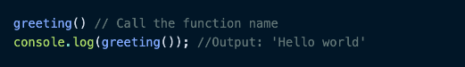

# __Writing Test Week 2__
## __Js Dasar-Scope & Function__
### __Js Dasar Scope__
- Scope adalah konsep dalam flow data variabel. 

    Menentukan suatu variabel bisa diakses pada scope tertentu atau tidak.

- Yang contoh nya seperti ini :
    Kita semua bisa melihat bintang-bintang dilangit karena bumi bersifat global.

    Namun jika kamu tinggal di Bandung, kamu tidak akan bisa melihat monas yang berada di jakarta. Monas bersifat local yaitu hanya berada di Jakarta.

- Blocks
    - Blocks adalah code yang berada didalam curly braces {}.

        Conditional, function, dan  looping menggunakan blocks.

- Global Scope
    - Global scope berarti variabel yang kita buat dapat diakses dimanapun dalam suatu file.

        Agar menjadi Global Scope, suatu variabel harus dideklarasikan diluar Blocks.

        Seperti contoh ini :

        

- Local scope 
    - Local scope berarti kita mendeklarasikan variabel didalam blocks seperti function, conditional, dan looping.

        Maka variabel hanya bisa diakses didalam blocks saja. Tidak bisa diakses diluar blocks.

        Seperti contoh ini :
	
        

### __Js Dasar Function__
-  Function adalah sebuah blok kode dalam sebuah grup untuk menyelesaikan 1 task/1 fitur.

    Saat kita membutuhkan fitur tersebut nantinya, kita bisa kembali menggunakannya.

- Membuat Function
    - Contoh nya seperti ini :

    
    
    

- Memanggil Function
    - Contoh nya seperti ini :
    
    
    
    

- Parameter dan Argumen
    - Parameter Function
        - Dengan parameter, function dapat menerima sebuah inputan data dan menggunakannya untuk melakukan task/tugas.
        - Saat membuat function/fitur, kita harus tahu data-data yang dibutuhkan. Misalnya saat membuat function penambahan 2 buah nilai. Data yang dibutuhkan adalah 2 buah nilai tersebut.

        
	
        
    
    - Argumen Function
        - Argumen adalah nilai yang digunakan saat memanggil function.
        - Jumlah argumen harus sama dengan jumlah parameternya
        - Jadi jika di function penambahan ada 2 parameter nilai saat membuat function. Saat memanggil function kita gunakan 2 buah nilai argumen.

            Seperti contoh ini :
	    
            
	    
            

    - Default Parameters
        - Default paramaters digunakan untuk memberikan nilai awal/default pada parameter function.

         Default parameters bisa digunakan jika kita ingin menjaga function agar tidak error saat dipanggil tanpa argumen

            Seperti contoh ini :
	    
            

    - Function Helper
        - Kita bisa menggunakan function yang sudah dibuat pada function lain.

            Seperti contoh ini :
	    
            

    - Arrow Function
        - Arrow function adalah cara lain menuliskan function. Ini adalah fitur terbaru yang ada pada ES6 (Javascript Version)

            Seperti contoh ini :
	    
            

    - Short Syntax Function
        
        
	
        

<hr>

## __Data Type Built In Prototype & Method__
### __Data Type__
- Javascript adalah bahasa pemograman yang dinamis
- Javascript memilki dua jenis tipe data 
    1. Primitive 
    2. Non Primitive

    - Boolean

        Boolean mewakili entitas logis dan dapat memiliki dua nilai benar dan salah. 

    - Null

        Tipe data Null memiliki satu nilai yaitu null

    - Undefined

        Variabel yang belum diberi nilai memiliki nilai yang tidak terdefinisi

    - Number

        Number adalah tipe data yang memilki satu bilangan bulat

        contoh :

        

    - Math 

        Math adalah objek bawaan yang memiliki properti dan metode untuk konstanta dan fungsi matematika. Ini bukan objek fungsi.

        Math bekerja dengan tipe Number. Ini tidak bekerja dengan BigInt.

        Tidak seperti banyak objek global lainnya, Math bukanlah sebuah konstruktor. Semua properti dan metode Math bersifat statis. Anda merujuk ke pi konstan sebagai Math.PI dan Anda memanggil fungsi sinus sebagai Math.sin(x), di mana x adalah argumen metode. Konstanta didefinisikan dengan presisi penuh bilangan real dalam JavaScript.

        Static Properties 

        - Math . E
        - Math . LN2
        - Math . LN10
        - Math . LOG2E
        - Math . LOG10E
        - Math . PI
        - Math . SQRT1_2
        - Math . SQRT2

        Static method 

        - Math . abs(.).
        - Math . acos(.).
        - Math . acosh(.).
        - Math . asin(.).
        - Math . asinh(.).
        - Math . atan(.).
        - Math . atanh(.).
        - Math . atan2(.).
        - Math . cbrt(.).
        - Math . ceil(.).
        - Math . clz32(.).
        - Math . cos(.).
        - Math . cosh(.).
        - Math . exp(.).
        - Math . expm1(.).
        - Math . floor(.)
        - Math . fround(.).
        - Math . hypot(.).
        - Math . imul(.).
        - Math . log(.).
        - Math . log1p(.).
        - Math . log10(.).
        - Math . log2(.).
        - Math . max(.).
        - Math . min(.).
        - Math . pow(.).
        - Math . random (.).
        - Math . round(.).
        - Math . sign(.).
        - Math . sin(.).
        - Math . sinh(.).
        - Math . sqrt(.).
        - Math . tan(.).
        - Math . tanh(.).
        - Math . trunc(.).

        Contoh :

        Konversi antara derajat dan radian
        Fungsi trigonometri sin(), cos(), tan(), asin(), acos(), atan(), dan atan2() mengharapkan (dan mengembalikan) sudut dalam radian.

        Karena manusia cenderung berpikir dalam derajat, dan beberapa fungsi (seperti transformasi CSS) dapat menerima derajat, adalah ide yang baik untuk menjaga agar fungsi tetap berguna yang mengkonversi antara keduanya:

        


    - Bigln

        Tipe BigInt adalah primitif numerik dalam JavaScript yang dapat mewakili bilangan bulat dengan presisi arbitrer. Dengan BigInts, Anda dapat dengan aman menyimpan dan mengoperasikan bilangan bulat besar bahkan di luar batas bilangan bulat aman untuk Numbers.

        BigInt dibuat dengan menambahkan n ke akhir bilangan bulat atau dengan memanggil konstruktor.

        Anda dapat memperoleh nilai aman terbesar yang dapat ditambahkan dengan Numbers dengan menggunakan konstanta Number.MAX_SAFE_INTEGER. Dengan diperkenalkannya BigInts, Anda dapat beroperasi dengan angka di luar Number.MAX_SAFE_INTEGER.

        Contoh nya :

        

        Anda dapat menggunakan operator +, *, -, **, dan % dengan BigInts—seperti halnya dengan Numbers. BigInt tidak sepenuhnya sama dengan Angka, tetapi secara longgar begitu.

        BigInt berperilaku seperti Angka jika dikonversi ke boolean: if, ||, &&, Boolean, !.

        BigInts tidak dapat dioperasikan secara bergantian dengan Numbers. Sebaliknya TypeError akan dilemparkan.

    - String

        Jenis String JavaScript digunakan untuk mewakili data tekstual. Ini adalah satu set "elemen" dari nilai integer 16-bit unsigned. Setiap elemen dalam String menempati posisi dalam String. Elemen pertama berada pada indeks 0, berikutnya pada indeks 1, dan seterusnya. Panjang dari sebuah String adalah jumlah elemen di dalamnya.

        String JavaScript tidak dapat diubah. Ini berarti bahwa setelah string dibuat, tidak mungkin untuk mengubahnya.

        Namun, masih dimungkinkan untuk membuat string lain berdasarkan operasi pada string asli. Sebagai contoh:

        Sebuah substring dari aslinya dengan memilih huruf individu atau menggunakan substring().

        Penggabungan dua string menggunakan operator penggabungan (+) atau concat().

        Sangat mudah untuk membangun string kompleks dengan penggabungan.

        String mudah untuk di-debug (apa yang Anda lihat dicetak selalu apa yang ada di string).

        String adalah penyebut umum dari banyak API (bidang input, nilai penyimpanan lokal, respons XMLHttpRequest saat menggunakan responseText, dll.) 

        Gunakan string untuk data tekstual. Saat mewakili data kompleks, parsing string, dan gunakan abstraksi yang sesuai.

        Membuat string dapat dibuat sebagai primitif, dari literal string atau sebagai objek menggunakan konstruktor string(): 

        

        Primitif string dan objek string memiliki banyak perilaku, tetapi memiliki perbedaan dan peringatan penting lainnya. Lihat "Primitif string dan objek String" di bawah.

        Literal string dapat ditentukan menggunakan tanda kutip tunggal atau ganda, yang diperlakukan secara identik, atau menggunakan karakter backtick `. Formulir terakhir ini menetapkan literal templat: dengan formulir ini Anda dapat menginterpolasi ekspresi.


    - Symbol

        Symbol adalah nilai primitif yang unik dan tidak dapat diubah dan dapat digunakan sebagai kunci dari properti Objek (lihat di bawah). Dalam beberapa bahasa pemrograman, Simbol disebut "atom". 

    -  Object
        - Properties

            Dalam JavaScript, objek dapat dilihat sebagai kumpulan properti. Dengan sintaks literal objek, sekumpulan properti terbatas diinisialisasi; maka properti dapat ditambahkan dan dihapus. Nilai properti dapat berupa nilai jenis apa pun, termasuk objek lain, yang memungkinkan membangun struktur data yang kompleks. Properti diidentifikasi menggunakan nilai kunci. Nilai kunci adalah nilai String atau nilai Simbol.

            Ada dua jenis properti objek: properti data dan properti pengakses. Setiap properti memiliki atribut yang sesuai. Setiap atribut diakses secara internal oleh mesin JavaScript, tetapi Anda dapat mengaturnya melalui Object.defineProperty(), atau membacanya melalui Object.getOwnPropertyDescriptor().

        - Data Property

            Properti data mengaitkan kunci dengan nilai. Hal ini dapat dijelaskan dengan atribut berikut:

            Value : yang diambil oleh akses get properti. Dapat berupa nilai JavaScript apa pun.

            Writable : ditulis
            Nilai boolean yang menunjukkan apakah properti dapat diubah dengan penugasan.

            Enumerable : Nilai boolean yang menunjukkan jika properti dapat dihitung oleh for...in loop. Lihat juga Enumerabilitas dan kepemilikan properti untuk mengetahui bagaimana enumerabilitas berinteraksi dengan fungsi dan sintaks lainnya.

            Configurable : Nilai boolean yang menunjukkan apakah properti dapat dihapus, dapat diubah menjadi properti pengakses, dan dapat mengubah atributnya.

        - Accessor Property

            Accessor Property memiliki atribut : 

            Get : Fungsi yang dipanggil dengan daftar argumen kosong untuk mengambil nilai properti setiap kali akses get ke nilai dilakukan. Lihat juga getter. Mungkin tidak terdefinisi.

            Set : Fungsi yang dipanggil dengan argumen yang berisi nilai yang ditetapkan. Dieksekusi setiap kali properti tertentu dicoba untuk diubah. Lihat juga setter. Mungkin tidak terdefinisi.

            Enumerable : Nilai boolean yang menunjukkan jika properti dapat dihitung oleh for...in loop. Lihat juga Enumerabilitas dan kepemilikan properti untuk mengetahui bagaimana enumerabilitas berinteraksi dengan fungsi dan sintaks lainnya.

            Configurable : Nilai boolean yang menunjukkan apakah properti dapat dihapus, dapat diubah menjadi properti data, dan dapat mengubah atributnya.

        - "Normal" objects, and functions
            
            Objek JavaScript adalah pemetaan antara kunci dan nilai. Kunci adalah string (atau Simbol), dan nilai dapat berupa apa saja. Ini membuat objek cocok secara alami untuk peta hash.

            Fungsi adalah objek biasa dengan kemampuan tambahan yang dapat dipanggil.

        - Dates 

            Saat mewakili tanggal, pilihan terbaik adalah menggunakan utilitas Tanggal bawaan di JavaScript.

        - Indexed collections: Arrays and typed Arrays

            Array adalah objek reguler yang memiliki hubungan tertentu antara properti berkunci integer dan properti panjang.

            Selain itu, array mewarisi dari Array.prototype, yang menyediakan beberapa metode praktis untuk memanipulasi array. Misalnya, indexOf() (mencari nilai dalam array) atau push() (menambahkan elemen ke array), dan seterusnya. Ini membuat Array kandidat yang sempurna untuk mewakili daftar atau set.

        - Keyed collections: Maps, Sets, WeakMaps, WeakSets

            Perbedaan antara Maps dan WeakMaps adalah bahwa pada yang pertama, kunci objek dapat dicacahkan. Ini memungkinkan pengoptimalan pengumpulan sampah dalam kasus terakhir.

            Anda dapat mengimplementasikan Maps dan Sets sendiri. Namun, karena objek tidak dapat dibandingkan (dalam arti < "kurang dari", misalnya), mesin juga tidak mengekspos fungsi hashnya untuk objek, kinerja pencarian tentu akan linier. Implementasi asli dari mereka (termasuk WeakMaps) dapat memiliki kinerja pencarian yang kira-kira logaritmik ke waktu yang konstan.

<hr>

## __DOM__

-  Proses rendering di balik layar

    

    

    Sama halnya, proses barusan juga dilakukan kepad file CSS

    

    

    

- Isu terkait proses rendering

    Jika saat proses parsing HTML, ditemukan tag ```<script>```, secara default proses parsing akan dihentikan sampai script tersebut selesai diunduh dan dijalankan

    

    script tag block parsing/DOM construction karena ngga yakin si JS ini mau ngapain

    Ngga kayak JS, CSS harus diload duluan, kalo ngga ya tampilannya jelek, ngga bisa diload belakangan, tapi kan bisa dicache

    Jika script yang diunduh itu besar, ada jeda yang cukup lama antara halaman mulai dimuat sampai keluar tampilan

    Solusinya?

     - Taruh tag ```<script>``` eksternal sebelum tag penutup ```</body>``` - ini solusi paling umum agar dia mulai diproses setelah parsing HTML selesai.
     - Taruh tag ```<script> ```sedini mungkin dan gunakan atribut async - atribut async akan membuat script tersebut diunduh tanpa menghentikan proses parsing dan dieksekusi seselesainya ia diunduh.

     - Untuk script yang bergantung pada DOM, taruh tag ```<script>``` sedini mungkin, dan gunakan atribut defer - atribut defer akan membuat script tersebut diunduh tanpa menghentikan proses parsing dan dieksekusi seselesainya proses parsing selesai.


        Harus dikasih tahu kalau belum semua browser support async, dan script yg dikasih async ngga boleh bergantung pada element DOM, soalnya pas dia dieksekusi, ada kemungkinan DOM belum selesai diload.

- Memanipulasi Element HTML

    DOM bukan bagian dari JavaScript, 
    melainkan browser (Web API).

    JS dipakai di luar browser, node.js misalnya, DOM ini ya ngga ada. Kalau mau ada pakai DOM harus minta bantuan dari library.

- Mencari element HTML

    

    getElementsByClassName itu bakal ngereturn bentuk array; walaupun cuma ada 1 element dengan class itu.
    Kalau bisa diulangin lagi penggunaan id dan class (id cuma boleh 1 element per page, class bisa beberapa sekaligus dan per element bisa beberapa class).

- Mengubah Konten Element 
    - Element.textContent
    - Element.onevent

        Element.textContent dapat kita gunakan untuk
        mengubah teks di dalam sebuah element

        


- Element.innerHTML

    Element.innerHTML dapat kita gunakan untuk
    mengubah konten HTML di dalam sebuah element.

    

    Harus dibandingkan dengan .textContent sebelumnya, misal kalau pakai textContent kita tambahin ```<h1>```asdasd```</h1>``` itu nanti di webpagenya beneran tertulis “ ```<h1>```asdads```</h1>```”. Sedangkan kalau pakai .innerHTML kan kasilnya “asdasd” jadi heading

- Perbandingan innerHTML dan textContent

    

    textContent itu bener-bener  cuma teksnya yg diubah, sedangkan dengan innerHTML, kalau ketemu tag html ya bakal diubah jadi element html juga.

- Membuat Element HTML

    

- Interaksi User (Events)

    User experience itu bersifat dua arah: 
    selain menampilkan element HTML, halaman web juga harus bisa menangkap interaksi user

- Berbagai HTML DOM Event 

    

- Menangkap Interaksi User
- Element.addEventListener(“event”)

    - Dengan cara Element.addEventListener(“event”)
    - Bisa dihilangkan
        Bisa ada beberapa event listener yang sama untuk 1 element
    - Memiliki argument tambahan { options }

    - EventListener - Click

        Misalkan kita mempunyai element ```<input id=”user-input” />```  dan ```<button id=”alert-button”>```show```</button>```. 
        Kita ingin menampilkan pop up box yang berisi teks di dalam input tadi.

        cari dulu kedua element tersebut berdasarkan id-nya
        ```
        const input = document.getElementById(“user-input”)

        const button = document.getElementById(“alert-button”)
        ```

        baru tambahkan event listener
        ```
        button.addEventListener(“click”, function() {
	    alert(input.value)
        })
        ```

        atau
        ```
        button.onclick = function() { alert(input.value) }
        ```
        
        - EventListener - Blur

            “Blur”, lawan dari “focus”, adalah event di mana sebuah element kehilangan fokus dari user (misal user klk mouse di luar element tersebut atau user klik tab untuk berpindah element)

            Misalkan kita ingin memvalidasi isi dari ```<input id=”username” />``` agar panjangnya minimal 6 karakter..

            cari dulu element tersebut berdasarkan id-nya
            ```
            const input = document.getElementById(“username”)
            ```

            tambahkan event listener
            ```
            input.addEventListener(“blur”, () => {
	        if(input.value.length < 6) alert(“Panjang username minimal 6”)
            })
            ```

        - EventListener - Form Submission

            Misalkan kita mempunyai element beberapa input dalam sebuah form ```<input name=”email /> dan <input type=”password” name=”password” />```. Bagaimana caranya  kita mendapatkan isi dari kedua input tersebut saat submit form?

            Ada 2 cara:
            1. Pasang  event listener di kedua input dan tombol submit, lalu saat tombol diklik, baca value dari kedua input tersebut. 

            2. Pasang  event listener di form, lalu gunakan FormData untuk mengambil data dari masing-masing input

        Pasang event listener di form, lalu gunakan FormData untuk mengambil data dari masing-masing input

        ```
        const form = document.getElementById(“form”)

        form.addEventListener(“submit”, function(event) {
	    // cegah page refresh
	    event.preventDefault()

	    const formData = new FormData(form)
	    const values = Object.fromEntries(formData) // { email: ... }
        })
        ```


    


